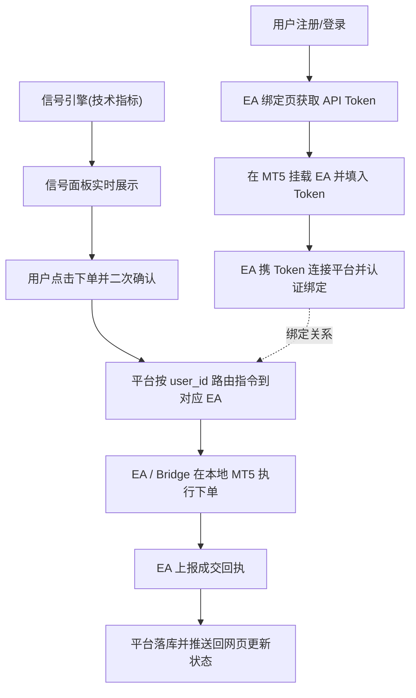

# PRISMX Signal Lab（棱镜信号实验室）产品需求文档

## 1. 产品概述

PRISMX Signal Lab 是一个交易信号生成与下单链路平台：后端基于技术指标自动生成交易信号，用户在网页上查看信号并点击下单，指令经由桥接通道下发到用户自己 MT5 终端上挂载的 EA 执行，并将成交回执回传展示。

- 解决「信号产生 → 人工确认 → 自动在 MT5 执行 → 回执反馈」的全链路打通问题，面向需要把策略信号落地到 MT5 的交易者。
- **当前阶段**:已上线生产环境 — 前端 Vercel + 后端腾讯云 VPS + Supabase PostgreSQL。用户可注册、查看信号、下单,并通过 Bridge.exe 在本地 MT5 执行真实/模拟交易。正式域名 `prismxsignallab.com` 指向前端(Vercel),`api.prismxsignallab.com` 指向后端(VPS)。

## 2. 核心功能

### 2.1 用户角色

| 角色 | 注册方式 | 核心权限 |
|------|----------|----------|
| 注册用户 | 邮箱 + 密码注册 | 查看信号、绑定 EA、下单、查看持仓与下单历史 |
| 管理员 | 预置账户 | 手动发布信号、查看所有用户连接状态 |

### 2.2 功能模块

所需核心页面:

1. **登录/注册页**：账号登录、注册，获取访问凭证。
2. **信号面板页（主页）**：实时信号列表、信号详情、下单确认入口、EA 连接状态指示。
3. **EA 绑定页**：展示用户专属 API Token、复制 Token、查看/重置绑定、MT5 账号登记。
4. **订单与回执页**：下单历史、执行状态、成交回执、持仓概览。

### 2.3 页面详情

| 页面名称 | 模块名称 | 功能描述 |
|----------|----------|----------|
| 登录/注册页 | 认证表单 | 邮箱+密码登录与注册，登录后下发 JWT，存储于前端；中英文切换 |
| 信号面板页 | 信号列表 | 实时展示信号（品种、方向、入场价、止损、止盈、有效期、生成时间），WebSocket 推送更新 |
| 信号面板页 | 下单确认 | 点击信号上的「下单」弹出二次确认，可填写手数，提交后调用下单 API |
| 信号面板页 | EA 状态条 | 实时显示当前用户 EA 是否在线、绑定的 MT5 账号、心跳时间 |
| EA 绑定页 | Token 管理 | 显示专属 API Token，支持复制与重置；说明 EA 填入方式 |
| EA 绑定页 | MT5 账号登记 | 登记用户 MT5 账号号与服务器名，用于绑定校验 |
| 订单与回执页 | 订单历史 | 列出已发出的下单指令、状态（待执行/已成交/失败/拒绝）、回执详情、错误信息 |
| 订单与回执页 | 持仓概览 | 展示 EA 上报的当前持仓（品种、方向、手数、浮动盈亏） |
| 全局 | 语言切换 | 中英双语切换，所有界面文案随之切换，偏好持久化 |

## 3. 核心流程

用户注册登录后,进入 EA 绑定页获取专属 API Token。MT5 端可通过两种方式接入:1) 把 Token 填入自己 MT5 上挂载的 PRISMX EA;2) 使用 PRISMX Bridge.exe 填入 Token 自动扫描本机 MT5 终端。接入后完成认证与绑定。信号引擎按技术指标产出信号并通过 WebSocket 推送到信号面板。用户在面板点击「下单」并二次确认后,平台按 user_id 将指令精准投递给该用户的 EA/Bridge,在本地 MT5 执行下单,并把成交回执上报平台,平台落库后推送回网页更新订单状态。

## 4. 用户界面设计

### 4.1 设计风格

- 主色：黑色（深空黑背景，多层次深灰分层）；辅助色：紫色（棱镜紫，用于强调、信号方向、关键按钮与高光）。
- 按钮风格：圆角矩形，紫色高光描边，悬停有发光与微动效；危险/下单操作用更醒目的实心紫。
- 字体：标题用富有科技感的展示字体，正文用清晰中性的无衬线字体，中文与英文各自匹配合适字族，字号层级分明。
- 布局风格：深色卡片式 + 顶部导航 + 侧边信息栏，信息密度适中，强调数据可读性。
- 图标/氛围：极简线性图标，配合棱镜分光、网格、霓虹辉光等暗色科技氛围细节。

### 4.2 页面设计概览

| 页面名称 | 模块名称 | UI 元素 |
|----------|----------|---------|
| 信号面板页 | 信号列表 | 深色卡片网格，方向用紫/红绿色标，辉光强调；数据等宽字体；新信号入场有渐显动画 |
| 信号面板页 | 下单确认 | 居中模态框，暗背景毛玻璃遮罩，紫色主按钮，手数输入与风险提示 |
| 信号面板页 | EA 状态条 | 顶部细条，在线绿点/离线灰点呼吸动画，显示账号与心跳 |
| EA 绑定页 | Token 管理 | 等宽 Token 展示框 + 复制按钮，重置带二次确认，紫色高亮 |
| 订单与回执页 | 订单历史 | 暗色表格，状态彩色标签，行悬停高亮 |
| 全局 | 语言切换 | 顶部导航右侧中/EN 切换开关 |

### 4.3 响应式

桌面优先设计，向下兼容移动端：信号卡片网格在窄屏转为单列，导航折叠为抽屉式，关键操作按钮触控友好。

## 5. 当前阶段说明

- 已部署上线:前端 Vercel,后端 VPS(systemd 常驻),数据库 Supabase PostgreSQL。
- 后端通过 `DATABASE_URL` 环境变量切换数据库:未设时默认本地 SQLite,设值则走 Supabase Postgres。
- 前端通过 `VITE_API_BASE` 环境变量切换后端地址:留空走 Vite 开发代理,设值(如 `https://api.prismxsignallab.com`)走线上。
- 信号来源为技术指标算法（如均线/RSI 交叉）,每 15 秒自动生成,预留手动发布与外部信号源扩展位。
- 提供两个版本的 EA(见技术架构文档),并通过 PRISMX Bridge.exe 实现原生 MT5 下单(不再仅依赖 EA WebSocket)。
- MT5 账户支持 Demo 模拟账户或真实账户,视用户 MT5 终端登录的账户类型而定。
- 正式域名:前端 `prismxsignallab.com`,后端 `api.prismxsignallab.com`。

## 6. 优化迭代记录

### 6.1 第一批：安全与正确性

本批聚焦"不出错、不重复下单、看得准、用得稳",部署已完成(前端 Vercel + 后端 VPS + Supabase)。

| 编号 | 项目 | 问题 | 优化目标 |
|------|------|------|----------|
| O-1 | 订单回执可靠性 | 指令下发即标记 delivered，若回执丢失订单永远卡在"待执行"，用户易重复下单 | 回执接口幂等；桥接回报失败重试；超时未回执的订单自动转可重发或标记 FAILED；前端按真实回执提示 |
| O-2 | 基础风控 | 仅校验单笔最大手数，小余额账户易爆仓 | 增加最小手数校验、按账户净值粗估的手数上限、友好的中英错误提示 |
| O-3 | 连接状态统一 | 旧 EA 卡片读旧数据恒显示"离线"，与桥接账户状态并存，误导用户 | 状态条改读桥接账户聚合在线状态，移除/合并旧的误导卡片 |
| O-4 | 桥接程序加固 | Token 明文存盘；可被误关；无版本号；无运行日志 | Token 用 Windows DPAPI 加密存储；关闭时二次确认；显示版本号；写本地运行日志文件 |
| O-5 | 下单体验 | 提示"已排队"而非真实结果；订单表不显示目标账户 | 等真实回执提示"已成交@价"或"被拒原因"；订单表增加目标账户列 |

### 6.2 已完成 / 暂缓项

- ✅ ~~后端上线部署 + 正式数据库~~ — 已上线:前端 Vercel + 后端 VPS(Ubuntu 24.04, systemd) + Supabase PostgreSQL。详见《运维手册》。
- 真实行情信号接入（用户后续自行对接）。
- 网页平仓、账户级跟单开关、通知提醒、信号统计等增强功能，列入后续批次。
