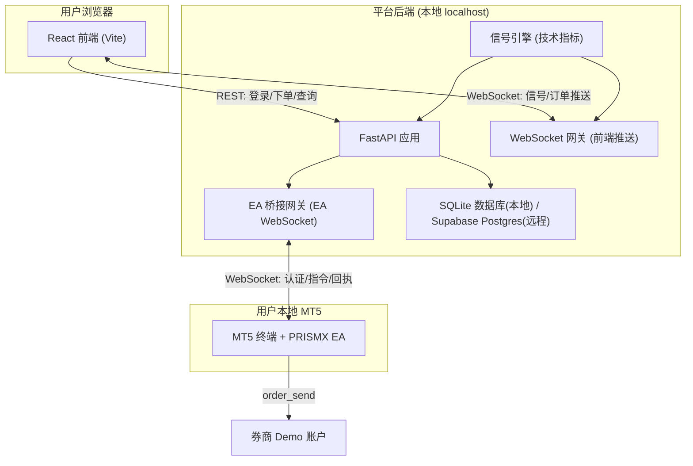
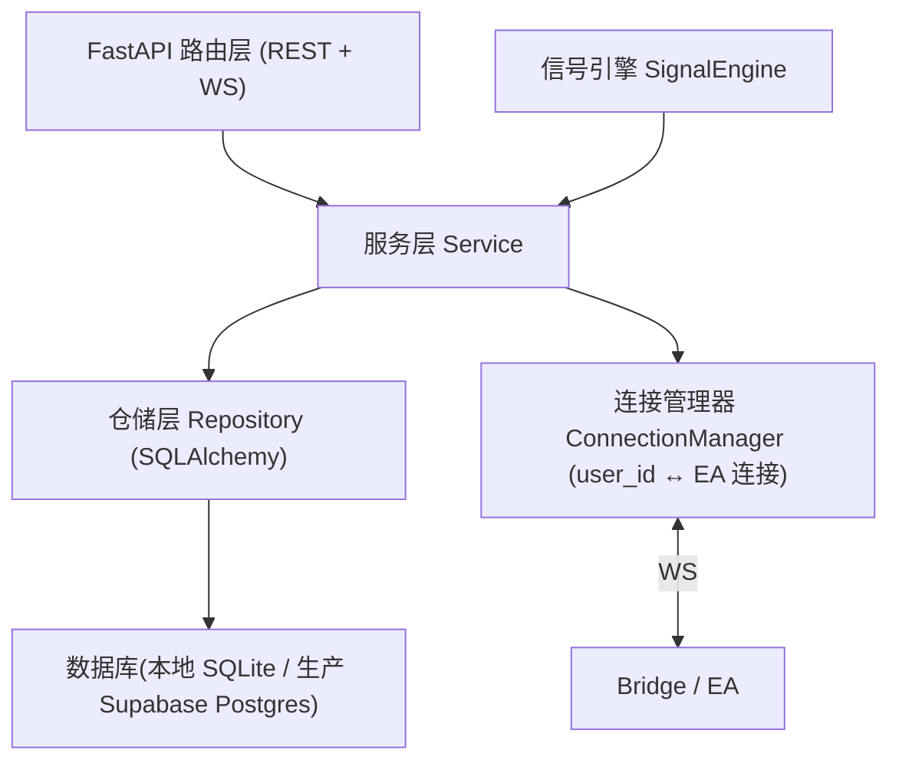
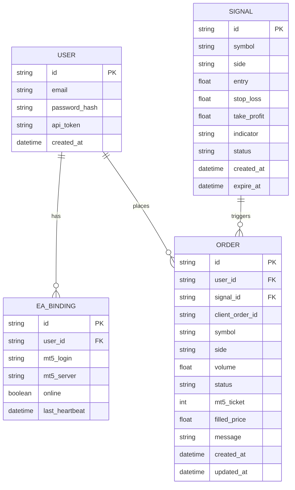

# PRISMX Signal Lab（棱镜信号实验室）技术架构文档

## 1. 架构设计

### 1.1 生产部署架构(当前线上状态)

```
用户浏览器(prismxsignallab.com / prismx-signal-lab.vercel.app)
  │
  ↓  HTTPS
Vercel(前端静态托管, Vite, root: frontend/)
  │  调用 https://api.prismxsignallab.com
  ↓
腾讯云 VPS — Nginx(HTTPS 终止, Let's Encrypt 自动续期)
  │  proxy_pass → 127.0.0.1:8000
  ↓
FastAPI 应用(uvicorn + systemd 常驻,开机自启+崩溃重启)
  ├─ REST API(注册/登录/信号/下单/EA 轮询)
  ├─ WebSocket 网关(/ws 前端推送 + /ws/ea EA 双向)
  ├─ 信号引擎(技术指标,每 15 秒生成信号)
  └─ EA 桥接
       │  WebSocket / REST HTTP 轮询(两版 EA)
       ↓
用户本地 MT5 终端 + PRISMX Bridge.exe(扫描 terminal64.exe)
  → 真实下单执行 / 回执上报
```

数据流:
- **前端 ↔ 后端**: VITE_API_BASE 环境变量指向 `api.prismxsignallab.com`,REST 走 `https://`,WebSocket 自动 `wss://`
- **后端 ↔ 数据库**: Supabase PostgreSQL 17.6(Session pooler, 端口 5432, 走 IPv4)
- **后端 ↔ MT5**: Bridge 连接 `/ws/ea`(WebSocket 实时)或 `/api/ea/poll`(HTTP 轮询),带 API Token 认证

### 1.2 本地开发架构(用于本地调试)



说明:本地开发时前端通过 Vite 代理转发 `/api` 到 `localhost:8000`;VITE_API_BASE 留空则自动走代理,设值则走线上。`DATABASE_URL` 不设时默认使用本地 SQLite(`sqlite:///./prismx.db`)。

## 2. 技术说明

- 前端：React@18 + TypeScript + tailwindcss@3 + Vite；i18n 采用 react-i18next 实现中英双语切换。API 地址通过 `VITE_API_BASE` 环境变量配置(生产指向 `https://api.prismxsignallab.com`,本地留空走 Vite 代理)。
- 后台：Python + FastAPI（REST + WebSocket 一体），uvicorn 运行；信号引擎用 pandas + 技术指标计算。
- 部署：前端 Vercel(自动构建+部署),后端腾讯云 VPS(Ubuntu 24.04)通过 systemd 常驻 + Nginx 反代 + Let's Encrypt HTTPS。
- 数据库：支持双模式 — 本地开发默认 SQLite(`DATABASE_URL` 未设置时);生产通过 `.env` 中 `DATABASE_URL` 指定 Supabase PostgreSQL。ORM 用 SQLAlchemy,迁移自动适配类型(SQLite DATETIME ↔ Postgres TIMESTAMP)。
- 认证：JWT（用户登录,密钥由环境变量 `JWT_SECRET` 提供）；EA 使用 per-user API Token 认证。
- Bridge：Python + tkinter GUI,打包为独立 exe(PyInstaller)。连接时扫描本机 MT5(`terminal64.exe`),后端地址写死为 `https://api.prismxsignallab.com`,用户只需填 API Token。
- EA：MQL5，提供两个版本（见第 7 节），均内置中英双语文案与日志。

### 关键配置说明

以下为上线后做过的重要改动,接手维护时需了解其设计意图:

**数据库双模式** ([database.py](file:///c:/Users/REX/Downloads/PRISMX%20SIGNAL/backend/app/core/database.py#L37-L69)): `_migrate_columns` 通过 `DATABASE_URL` 前缀自动切换类型 — SQLite 用 `DATETIME`,Postgres 用 `TIMESTAMP`。`.env` 中设完整的 `postgresql://` 连接串即可切换,不设则默认本地 SQLite。

**前端 API 寻址** ([client.ts](file:///c:/Users/REX/Downloads/PRISMX%20SIGNAL/frontend/src/api/client.ts#L8) / [useClientSocket.ts](file:///c:/Users/REX/Downloads/PRISMX%20SIGNAL/frontend/src/store/useClientSocket.ts#L19-L29)): 通过 `VITE_API_BASE` 环境变量控制。生产设 `https://api.prismxsignallab.com`,本地留空走 Vite 代理。WebSocket 地址自动 `http→ws` / `https→wss` 转换。[vite-env.d.ts](file:///c:/Users/REX/Downloads/PRISMX%20SIGNAL/frontend/src/vite-env.d.ts) 提供 `ImportMetaEnv` 类型声明,缺乏则 `tsc -b` 报 TS2339。

**CORS** ([config.py](file:///c:/Users/REX/Downloads/PRISMX%20SIGNAL/backend/app/core/config.py#L18-L23)): 精确名单 + 正则双通道 — `CORS_ORIGINS` 放行正式域名和 localhost,`CORS_ORIGIN_REGEX = r"https://.*\.vercel\.app"` 覆盖所有 Vercel 部署(含预览域名)。

**Bridge** ([bridge_app.py](file:///c:/Users/REX/Downloads/PRISMX%20SIGNAL/bridge/bridge_app.py#L30)): 后端地址写死 `DEFAULT_BACKEND = "https://api.prismxsignallab.com"`,输入框已隐藏。`scan_terminals` 仅匹配 MT5(`terminal64.exe`),排除 MT4(`terminal.exe`);`initialize` 有 10 秒超时兜底。

## 3. 路由定义（前端）

| 路由 | 用途 |
|------|------|
| /login | 登录与注册页 |
| / | 信号面板页（主页，需登录） |
| /bind | EA 绑定页（Token 管理、MT5 账号登记） |
| /orders | 订单与回执页 |

## 4. API 定义

### 4.1 认证

用户注册
```
POST /api/auth/register
Request:  { "email": string, "password": string }
Response: { "token": string, "user": { "id": string, "email": string } }
```

用户登录
```
POST /api/auth/login
Request:  { "email": string, "password": string }
Response: { "token": string, "user": { "id": string, "email": string } }
```

### 4.2 EA 绑定

获取/重置 API Token
```
GET  /api/ea/token        -> { "apiToken": string, "boundAccount": string | null }
POST /api/ea/token/reset  -> { "apiToken": string }
```

登记 MT5 账号
```
POST /api/ea/account
Request:  { "mt5Login": string, "mt5Server": string }
Response: { "ok": true }
```

EA 在线状态
```
GET /api/ea/status -> { "online": boolean, "mt5Login": string | null, "lastHeartbeat": string | null }
```

### 4.3 信号

获取信号列表
```
GET /api/signals -> { "signals": Signal[] }

Signal = {
  "id": string,
  "symbol": string,         // 品种，如 EURUSD
  "side": "BUY" | "SELL",   // 方向
  "entry": number,          // 入场价
  "stopLoss": number,
  "takeProfit": number,
  "indicator": string,      // 触发指标说明
  "createdAt": string,
  "expireAt": string,
  "status": "ACTIVE" | "EXPIRED"
}
```

### 4.4 下单

提交下单（幂等）
```
POST /api/orders
Request:  {
  "signalId": string,
  "symbol": string,
  "side": "BUY" | "SELL",
  "volume": number,         // 手数
  "clientOrderId": string   // 前端生成的幂等键
}
Response: { "orderId": string, "status": "PENDING" }
```

查询订单
```
GET /api/orders -> { "orders": Order[] }

Order = {
  "id": string,
  "clientOrderId": string,
  "signalId": string,
  "symbol": string,
  "side": "BUY" | "SELL",
  "volume": number,
  "status": "PENDING" | "FILLED" | "REJECTED" | "FAILED",
  "mt5Ticket": number | null,
  "filledPrice": number | null,
  "message": string | null,
  "createdAt": string,
  "updatedAt": string
}
```

### 4.5 WebSocket 通道

前端通道 `/ws/client`（JWT 鉴权）：服务端推送
```
{ "type": "SIGNAL_NEW", "data": Signal }
{ "type": "ORDER_UPDATE", "data": Order }
{ "type": "EA_STATUS", "data": { "online": boolean, "mt5Login": string|null } }
```

EA 通道 `/ws/ea`（API Token 鉴权）：双向消息
```
EA -> 平台:
{ "type": "AUTH", "apiToken": string, "mt5Login": number, "mt5Server": string }
{ "type": "HEARTBEAT", "ts": number }
{ "type": "ORDER_RESULT", "clientOrderId": string, "success": boolean, "mt5Ticket": number, "filledPrice": number, "message": string }
{ "type": "POSITIONS", "data": Position[] }

平台 -> EA:
{ "type": "AUTH_OK", "userId": string }
{ "type": "AUTH_FAIL", "reason": string }
{ "type": "ORDER_CMD", "clientOrderId": string, "symbol": string, "side": "BUY"|"SELL", "volume": number, "stopLoss": number, "takeProfit": number }
```

## 5. 服务端架构图



下单路由逻辑：路由层接收下单请求 → 服务层做风控与幂等校验 → 落库为 PENDING → 通过连接管理器按 user_id 找到对应 EA 连接并下发 ORDER_CMD → 收到 ORDER_RESULT 后更新订单状态并经前端 WS 推送。

## 6. 数据模型

### 6.1 数据模型定义



### 6.2 数据定义语言

```sql
-- 用户表
CREATE TABLE users (
    id TEXT PRIMARY KEY,
    email TEXT UNIQUE NOT NULL,
    password_hash TEXT NOT NULL,
    api_token TEXT UNIQUE NOT NULL,
    created_at TIMESTAMP DEFAULT CURRENT_TIMESTAMP
);

-- EA 绑定表
CREATE TABLE ea_bindings (
    id TEXT PRIMARY KEY,
    user_id TEXT NOT NULL REFERENCES users(id),
    mt5_login TEXT,
    mt5_server TEXT,
    online BOOLEAN DEFAULT 0,
    last_heartbeat TIMESTAMP
);
CREATE INDEX idx_ea_user ON ea_bindings(user_id);

-- 信号表
CREATE TABLE signals (
    id TEXT PRIMARY KEY,
    symbol TEXT NOT NULL,
    side TEXT NOT NULL,
    entry REAL,
    stop_loss REAL,
    take_profit REAL,
    indicator TEXT,
    status TEXT DEFAULT 'ACTIVE',
    created_at TIMESTAMP DEFAULT CURRENT_TIMESTAMP,
    expire_at TIMESTAMP
);

-- 订单表
CREATE TABLE orders (
    id TEXT PRIMARY KEY,
    user_id TEXT NOT NULL REFERENCES users(id),
    signal_id TEXT REFERENCES signals(id),
    client_order_id TEXT NOT NULL,
    symbol TEXT NOT NULL,
    side TEXT NOT NULL,
    volume REAL NOT NULL,
    status TEXT DEFAULT 'PENDING',
    mt5_ticket INTEGER,
    filled_price REAL,
    message TEXT,
    created_at TIMESTAMP DEFAULT CURRENT_TIMESTAMP,
    updated_at TIMESTAMP DEFAULT CURRENT_TIMESTAMP,
    UNIQUE(user_id, client_order_id)
);
CREATE INDEX idx_order_user ON orders(user_id);
```

## 7. EA 的两个版本

两个版本均为 MQL5，内置中英双语（通过 EA 输入参数 `Language` 切换，影响图表注释与日志输出），均通过 `InpApiToken` 与平台绑定。

- **版本 A — WebSocket 实时版（PRISMX_EA_WS）**：通过 WebSocket 长连接平台 `/ws/ea`，实时接收下单指令、上报回执与持仓、维持心跳。低延迟，是主推方案。
- **版本 B — HTTP 轮询版（PRISMX_EA_Poll）**：通过 MT5 的 WebRequest 定时轮询平台 REST 接口拉取待执行指令并回报结果。无需 WebSocket 支持，兼容性更强，适合受限环境作为备选。

两版本对外的认证方式（API Token）、绑定逻辑（上报 mt5_login/mt5_server）、指令与回执的数据结构保持一致，便于平台统一处理。

## 8. 项目目录结构

```
PRISMX SIGNAL/
├── frontend/                  # React 前端
│   ├── src/
│   │   ├── pages/             # 登录、信号面板、绑定、订单页
│   │   ├── components/        # 复用组件
│   │   ├── i18n/              # 中英双语资源
│   │   ├── api/               # 接口与 WebSocket 封装
│   │   ├── store/             # 状态管理
│   │   ├── styles/            # 主题（黑紫）
│   │   └── vite-env.d.ts      # Vite 类型声明(import.meta.env)
│   ├── .env.example           # 环境变量示例(VITE_API_BASE)
│   ├── index.html
│   ├── package.json
│   ├── vite.config.ts         # 含开发期 /api 代理
│   └── tsconfig.json
├── backend/                   # FastAPI 后端
│   ├── app/
│   │   ├── routers/           # auth / signals / orders / ea / ws / ea_poll
│   │   ├── services/          # 业务逻辑（含连接管理器、风控）
│   │   ├── models/            # ORM 模型
│   │   ├── engine/            # 信号引擎（技术指标）
│   │   ├── core/              # 配置、安全、数据库(含 Postgres 迁移)
│   │   └── main.py
│   └── requirements.txt       # 含 psycopg2-binary(Postgres 驱动)
├── bridge/                    # PRISMX Bridge(MT5 桥接)
│   ├── bridge_app.py          # GUI 主程序(后端地址写死线上)
│   ├── mt5_worker.py          # MT5 扫描与下单 worker
│   ├── requirements.txt       # pyinstaller + MetaTrader5 + psutil
│   └── README.md              # 打包说明
├── ea/                        # MQL5 EA
│   ├── PRISMX_EA_WS.mq5       # 版本 A：WebSocket 实时版
│   └── PRISMX_EA_Poll.mq5     # 版本 B：HTTP 轮询版
├── .gitignore                 # 排除 .venv/.env/prismx.db/node_modules/dist 等
└── .trae/documents/           # 产品文档 / 技术架构 / 部署进度
```
